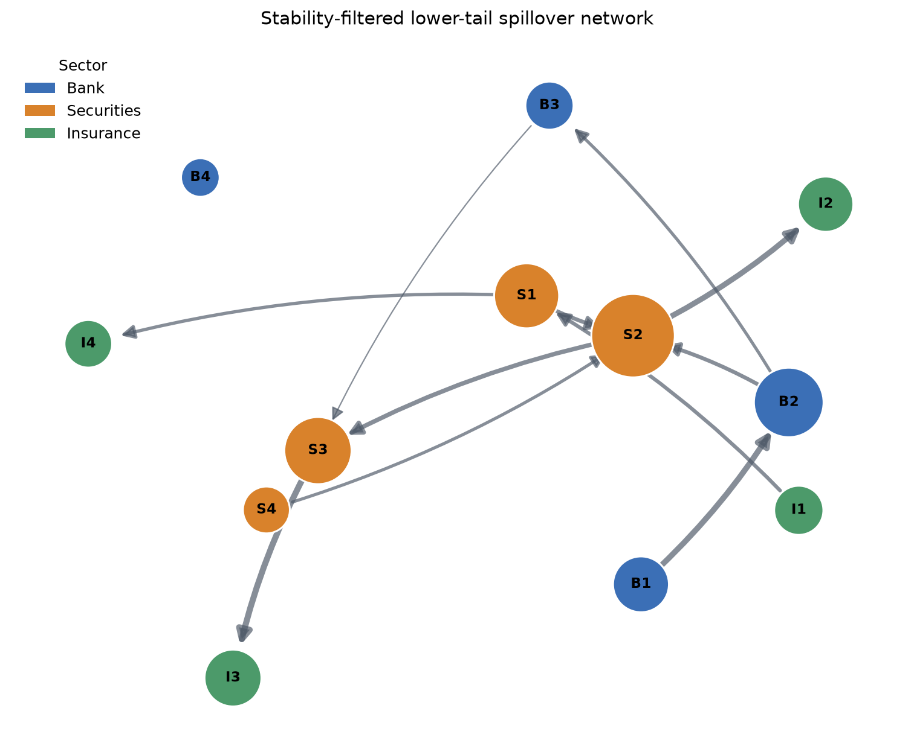

# TailRiskNet

**Dynamic tail-risk spillover networks for financial institutions, with explicit uncertainty and reproducibility checks.**

TailRiskNet turns a panel of institutional returns into rolling, directed lower-tail networks. It combines sparse quantile regression, Delta-CoVaR benchmarks, common-factor adjustment, moving-block bootstrap edge stability, and network diagnostics in one reproducible Python workflow.

The project grew out of my undergraduate research on systemic-risk spillovers among 34 listed Chinese financial institutions. The code is a methodological reconstruction and extension of that research question, not a claim of exact replication of the original proprietary-data results.



## Why this repository exists

Many empirical spillover studies produce a dense rolling network and then interpret the largest edges. Three problems are easy to miss:

1. a common market shock can make institutions look connected even when their idiosyncratic risks are not;
2. rolling-window edges can be unstable under small changes in the sample;
3. sector totals mechanically favor sectors containing more institutions.

TailRiskNet treats those as research-design problems. The default workflow therefore removes optional common factors, holds the L1 penalty fixed across evaluation windows, estimates moving-block bootstrap selection probabilities, and reports both total and exposure-count-normalized sector spillovers.

## What is implemented

| Component | Role in the research design |
|---|---|
| Sparse predictive-tail network | Joint L1-penalized quantile regressions use lagged peer returns to estimate directed lower-tail links while controlling for own-return persistence and state variables. |
| Pairwise quantile benchmarks | Contemporaneous Delta-CoVaR and lagged pairwise stress contrasts test whether conclusions depend on timing or high-dimensional conditioning. |
| Lagged tail co-exceedance | A distribution-free diagnostic measures the uplift in a target's tail-event probability after a source tail event. |
| Common-factor adjustment | PCA residualization separates system-wide comovement from idiosyncratic conditional tail dependence. |
| Edge stability | Circular moving-block bootstrap reports selection frequencies and weight intervals for every directed edge. |
| Network and sector summaries | Emitter, receiver, net-transmitter, size-adjusted, and sector-normalized measures use one documented edge orientation. |
| Known-graph simulation | A heavy-tailed data-generating process with known directional contagion tests edge recovery before real-data interpretation. |

Rows are always **risk sources** and columns are always **risk receivers**. This convention is enforced across matrices, edge lists, metrics, figures, and tests.

## Interpretation

For source institution $j$ and target institution $i$, the main model estimates the target's lower conditional quantile using lagged peer returns, the target's own lag, and predetermined state variables. The reported adverse edge is

\[
w_{j\rightarrow i,t}=\max\left\{0,-\widehat\beta_{j,i,t}
\left(q_\tau(r_{j,t-1})-q_{0.5}(r_{j,t-1})\right)\right\}.
\]

It measures how much the fitted lower quantile of $i$ deteriorates after $j$ moves from its median state to its lower-tail VaR, conditional on the model specification.

This is a **predictive conditional-tail network**. The lag supplies temporal ordering, but without external identification, balance-sheet exposures, or a structural model, its arrows must not be described as causal contagion. See [Methods](docs/METHODS.md) for the full estimand and limitations.

## Quick start

Python 3.10 or later is required.

```bash
python -m pip install -e ".[dev]"

# Recreate the versioned synthetic data
tailrisknet simulate --output data/demo --seed 2026

# Run rolling estimation, bootstrap diagnostics, tables, and figures
tailrisknet run --config configs/demo.yaml

# Check the research software
ruff check src tests examples
pytest
```

The complete demo is deterministic. Its results are written to `results/demo/`, together with SHA-256 input fingerprints and the exact run specification.

## Use with institutional data

Expected files are documented in [Data schema](docs/DATA_SCHEMA.md). A research template matching the original 34-institution Chinese application is provided at `configs/china_financial_institutions.yaml`.

```bash
tailrisknet run --config configs/china_financial_institutions.yaml
```

The repository deliberately excludes Wind returns, balance-sheet variables, and other licensed inputs. Users must provide data they are legally entitled to use. No download script circumvents vendor access controls.

## Repository map

```text
configs/                 Reproducible demo and China-application specifications
data/demo/               Versioned synthetic panel and known true graph
docs/                    Research design, methods, data contract, and references
examples/                Minimal Python API example
results/demo/            Curated synthetic outputs and figures
src/tailrisknet/         Tested research package
tests/                   Unit and end-to-end tests
```

## Methodological relationship to the thesis

The thesis combined VaR/CoVaR, single-index quantile regression, and a TENET-style dynamic network. TailRiskNet preserves the central question - who emits and receives tail risk, and how does that network change over time - while making several design choices independently:

- the package uses one-period-lagged L1-penalized quantile regression as a transparent and computationally reproducible main estimator, while contemporaneous Delta-CoVaR remains a benchmark;
- the original SIM/MACE-SCAD estimator is **not** presented as implemented here;
- the L1 penalty is calibrated once and fixed across rolling windows, rather than interpreted as a systemic-risk index;
- edge stability and known-graph recovery are treated as first-class outputs;
- sector comparisons report mean exposure as well as totals to address unequal sector size.

These choices make the code useful as a research platform while keeping the claims auditable.

## Reproducibility and status

Version `0.1.0` is a research release. The pipeline, simulation, configuration, tests, and curated demo are complete; the proprietary Chinese application cannot be reproduced without licensed data. Results from the synthetic demo are illustrative and make no claims about real institutions.

- [Research design](docs/RESEARCH_DESIGN.md)
- [Methods and estimands](docs/METHODS.md)
- [Reproducibility protocol](docs/REPRODUCIBILITY.md)
- [References](docs/REFERENCES.md)

## License and citation

Code is released under the MIT License. The synthetic data are generated by this repository and may be reused with attribution. Citation metadata are provided in `CITATION.cff`.
